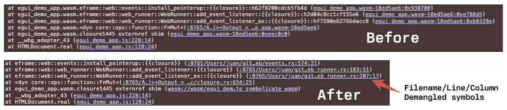

# wasm-stack trace

Wasm stack trace symbolication using embedded DWARF data. Works in the browser and node.js



## How to use

Place one of these `script` tags before any script that loads webassembly and you should be good to
go. The scripts are ~138kb gziped, including the embedded wasm that we use for DWARF processing.

Option 1. Link to the **current version** and use `integrity` for extra peace of mind

```
<script src="https://cdn.jsdelivr.net/npm/@membrane/wasm-stack-trace@0.1.1/dist/index.js" integrity="sha256-4ven6yDmBLbFNTJ3e+BT6LHZgVL9XbXNKYDUhAa/S0Y=" crossorigin="anonymous"></script>
```

Option 2. Link to the **latest version** so it's always up-to-date

```
<script src="https://cdn.jsdelivr.net/npm/@membrane/wasm-stack-trace@latest"></script>
```

Option 3. Download [the latest version](https://cdn.jsdelivr.net/npm/@membrane/wasm-stack-trace@latest) and self host it.

Option 4. Build it yourself (`npm run build`)

## Cargo setup

For symbolication to be possible, the right debug data needs to be included in your .wasm, so make
sure you configure cargo correctly. The default configuration for debug builds can easily turn a
10MB .wasm into 100MB or more which is often annoying. Instead, consider adding this to your
`Cargo.toml` to trim it down while keeping the data needed for proper stack traces:

```toml
[profile.dev]
debug = "line-tables-only"     # Recommended. Everything you need for proper stack traces.

debug = 1                      # Not sure if this helps with stack traces. but it "Generates more
                               # detailed module level info"

debug = 2                      # Default for "dev". Includes info on variables and types that are
                               # only used by debuggers. Greatly increases binary size so it's not
                               # recommended unless you plan to attach a debugger.
```

I also recommend using `opt-level=1` in debug builds, but that depends on your specific use case. The higher the `opt-level`, the more your call will get inlined potentially reducing the fidelity of the stack traces.

## How does it work?

- Patches WebAssembly functions so that it can map instances and modules to their corresponding
  .wasm file, where the DWARF data lives.
- Then, when a wasm module is compiled, we instantiate an tiny-ish (272kb) auxiliary wasm module that uses DWARF
  to convert the addresses reported in browser callstacks into proper demangled symbols and their
  corresponding location on disk (file/line/column). The latter loads the former into its memory in
  order to parse the DWARF data.
- The auxiliary module is lazily instantiated whenever an `Error.stack` property is accessed
  containing at least one wasm frame.
- The auxiliary wasm module is embedded as a base64 literal at the end of index.js file so the whole
  thing can be distributed as one .js file and avoid manual setup. It also allows `install` to
  run synchronously so that you can be sure that stacks will be symbolicated immedaitely.
- Finally, it sets an Error.prepareStackTrace that formats the callstack for every Error.
- Zero JavaScript dependencies. Only three (direct) rust dependencies for parsing wasm, parsing
  dwarf, and addr2line.

## Limitations

- The auxiliary module copies the entire main module's file into linear memory. This
  can be improved if it becomes problematic, we should be able to at least skip the code section.
  Usually the DWARF data is the heaviest so I'm not too concerned about this.
- Won't properly expand inlined functions. Should be easy to fix though.
- Not yet tested with languages other than Rust (should work for C++ by enabling the right cargo feature)
- Not yet tested on Firefox
- Not yet tested on Safari

## Alternatives

- Some tools can generate sourcemaps from DWARF data which can achieve a similar result. However, adding the sourcemap step to your development cycle can consume significant amount of time since all symbols will be processed eagerly. This approach keeps your build-test cycles very fast.
- Chrome has a [DevTools extension with DWARF support](https://chromewebstore.google.com/detail/cc++-devtools-support-dwa/pdcpmagijalfljmkmjngeonclgbbannb) which might help if you want the full debugger experience. In our experience, it doesn't work very well with Rust though.
